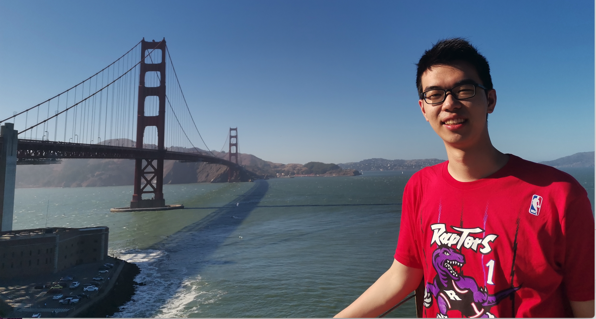

I am a CS PhD student at School of Computational Science and Engineering, Georgia Institute of Technology, advised by Prof. [Yunan Luo](https://faculty.cc.gatech.edu/~yunan/). I have broad interests in computational biology and machine learning, with a particular focus on developing AI methods to aid real-world biological and mediccal research.

Previously, I obtained a B.E. in computer science from Tsinhua University. I was honored to have worked with  Prof. [Maria Brbic](https://cs.stanford.edu/~mbrbic/), Prof. [Jure Leskovec](https://cs.stanford.edu/people/jure/) at Stanford and Prof. [Jie Tang](https://keg.cs.tsinghua.edu.cn/jietang/) at Tsinghua University. In the industry, I used to intern at Tencent Quantum Lab, working with Dr. [Chang-Yu Hsieh](https://scholar.google.com/citations?user=K-AjhSgAAAAJ&hl=id&oi=ao) and at [Helixon](https://www.helixon.com/), working with Prof. [Jian Peng](https://jianpeng.web.engr.illinois.edu/) and Prof. [Jianzhu Ma](https://majianzhu.com/).

My first name can be pronounced like Zion.

<!--  -->

Publications
======
Rewiring protein sequence and structure generative models to enhance protein stability prediction
**Ziang Li**, Yunan Luo \
*RECOMB 2025*
\[[pdf](https://www.biorxiv.org/content/10.1101/2025.02.13.638154v1.abstract)\] \| \[[code](https://github.com/luo-group/SPURS)\] 

Double-ended synthesis planning with goal-constrained bidirectional search
------
Kevin Yu, Jihye Roh, **Ziang Li**, Wenhao Gao, Runzhong Wang, Connor W. Coley \
*NeurIPS 2024* (Spotlight)
\[[pdf](https://arxiv.org/abs/2407.06334)\]
[Toward universal cell embeddings: integrating single-cell RNA-seq datasets across species with SATURN]
------
Yanay Rosen, Maria Brbić, Yusuf Roohani, Kyle Swanson, **Ziang Li**, Jure Leskovec \
*Nature Methods*
\[[pdf](https://www.nature.com/articles/s41592-024-02191-z)\] 
[Rethinking the Setting of Semi-supervised Learning on Graphs](https://arxiv.org/abs/2205.14403)
------
**Ziang Li** \*, Ming Ding \*, Weikai Li, Zihan Wang, Ziyu Zeng, Yukuo Cen, Jie Tang \
*IJCAI 2022* (oral)

<!-- Propose **ValidUtil** to explore the limit of over-tuning hyperparameters for semi-supervised learning on graphs. With **ValidUtil**, even GCN can easily get high accuracy of 85.8% on Cora. \
To avoid over-tuning, we construct an i.i.d. graph benchmark (**IGB**) consisting of 4 datasets which is proved to be a more stable benchmark than previous datasets for semisupervised learning on graphs. \ -->
\[[pdf](https://arxiv.org/pdf/2205.14403.pdf)\] \| \[[code](https://github.com/THUDM/IGB)\] 

[Modeling Protein Using Large-scale Pretrain Language Model]
------
Yijia Xiao, Jiezhong Qiu, **Ziang Li**, Chang-Yu Hsieh, Jie Tang \
*Pretrain@KDD 2021* 

Pretrained the second largest protein language model in the world, **Wen Su**, which exceeded baseline in protein folding contact prediction by 39%. \
\[[pdf](https://arxiv.org/pdf/2108.07435.pdf)\] \| \[[code](https://github.com/THUDM/ProteinLM)\]

More about me
======
<!-- 1. I completed most of college chemistry courses on my own in high school. I am also interested in the intersection of organic chemistry and computer science, e.g molecule generation, total synthesis, drug discovery and protein structural models.  -->
1. My favorite sport is basketball and I usually play as a power forward (PF). I can shoot the three, so I can also serve as a center in a small lineup. And I have been a fan of [**LeBron James**](https://en.wikipedia.org/wiki/LeBron_James) for more than 10 years!
1. I want to be an optimistic, cheerful and hard-working person with strong belief like [**Naruto Uzumaki**](https://en.wikipedia.org/wiki/Naruto_Uzumaki).

<!-- 
<small>

</small>
 -->
